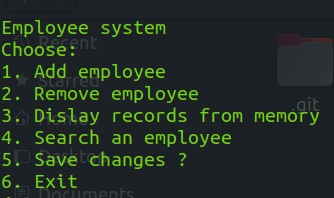
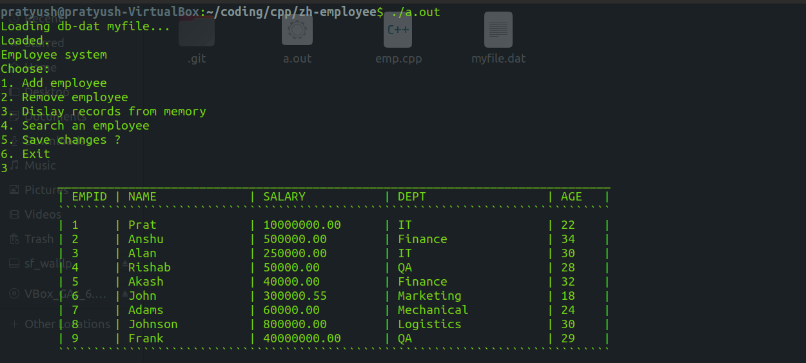
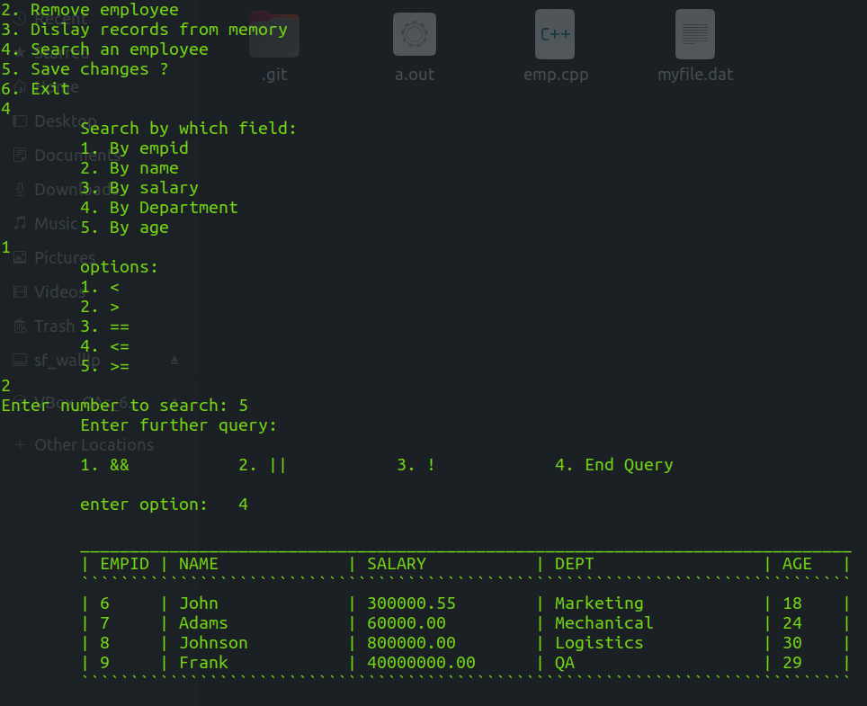
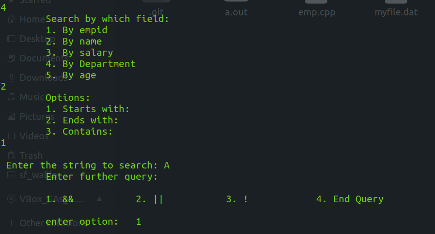
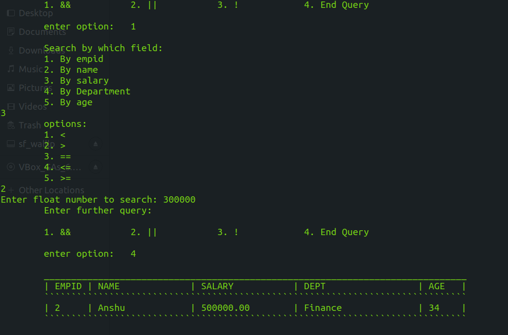

# Employee-DBMS
Zoho trainings -- Employee DBMS built using c++, with combination search queries

Design and built a Database management using C++.

On start, the application first loads in memory all the records that are stored in a file(.txt / .dat)

The user is promted with operations as Add, Delete, Display and Search records.

Options:

On exit if a user changes anything in the database (like add or remove records) the user is prompted with a message to save the changes(y/n) before exit.

Some examples are : ---

1. Display records

2. Search records: query :  
### empid > 5:

3. You can also extend search queries with Combinations options like:
i. AND operation
ii. OR operation
iii. NOT operation
example
### name starts with 'A' && salary > 3000000

